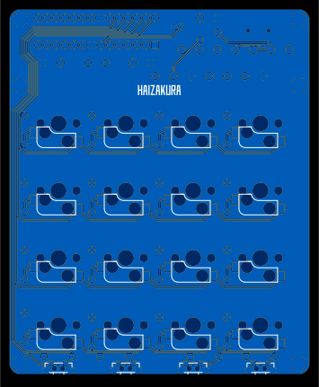

# My Keyboard

## NanoPad 16

> Under development...

## NanoPad 16 Retro

- ATMEGA328P

- RGB Lighting with WS2812

- DIP Switches

- Hot Plug Switches

- QMK Firmware [*Build yourself*](https://github.com/HAIZAKURA/my-keyboard/tree/main/nanopad16_retro/qmk/keyboards/haizakura/nanopad16_retro)

- Vial Compatible [*See how to use*](https://get.vial.today/docs/porting-to-via.html#done)

- Retro Style

### Top

### Bottom

 
