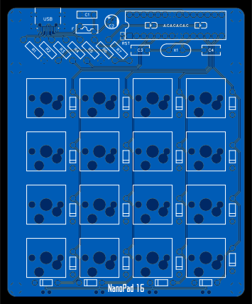
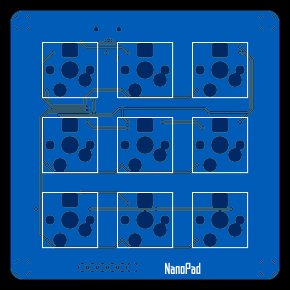
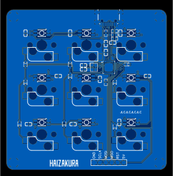

# My Keyboard

⌨️ Some keyboards designed by myself.

 

## NanoPad 16

> Under development...

## NanoPad 16 Retro

- ATMEGA328P-PU

- 16 Keys

- 4 DIP Switches

- Hot Plug Switches

- QMK Firmware [*Build by yourself*](https://github.com/HAIZAKURA/my-keyboard/tree/main/nanopad16_retro/qmk/keyboards/haizakura/nanopad16_retro)

- Vial Compatible [*See how to use*](https://get.vial.today/docs/porting-to-via.html#done)

- Retro Style

- [Project Files](https://github.com/HAIZAKURA/my-keyboard/tree/main/nanopad16_retro/hardware)

### Top

### Bottom

## NanoPad 9

- ATMEGA32U2-MU

- 9 Keys

- RGB Lighting with WS2812B

- Hot Plug Switches

- QMK Firmware [*Build by yourself*](https://github.com/HAIZAKURA/my-keyboard/tree/main/nanopad9/qmk/keyboards/haizakura/nanopad9)

- Vial Compatible [*See how to use*](https://get.vial.today/docs/porting-to-via.html#done)

- [Project Files](https://github.com/HAIZAKURA/my-keyboard/tree/main/nanopad9/hardware)

### Top

### Bottom

## Author

**my-keyboard** © [HAIZAKURA](https://nya.run), Released under the [MIT](./LICENSE) License.

> [Personal Website](https://nya.run) · GitHub [@HAIZAKURA](https://github.com/HAIZAKURA) · Twitter [@haizakura_0v0](https://twitter.com/haizakura_0v0) · Telegram [@haizakura](https://t.me/haizakura)

## Thanks

**qmk_firmware** © [QMK](https://github.com/qmk), Released under the [GNU General Public License](https://github.com/qmk/qmk_firmware/blob/master/LICENSE) .

> [qmk_firmware](https://github.com/qmk/qmk_firmware)

**vial-qmk** © [Vial](https://github.com/vial-kb), Released under the [GNU General Public License](https://github.com/qmk/https://github.com/vial-kb/vial-qmk/blob/vial/LICENSE) .

> [vial-qmk](https://github.com/vial-kb/vial-qmk)

